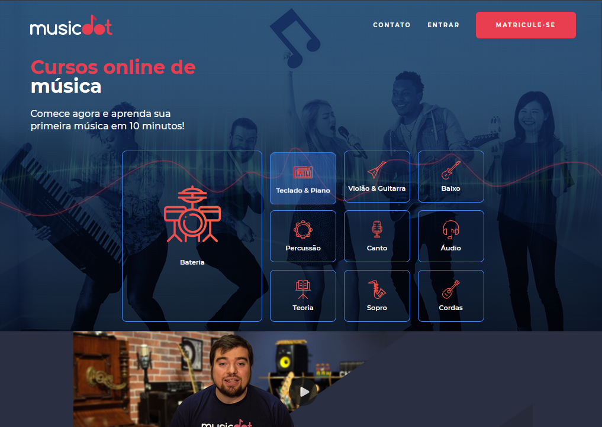

<h1 align="center">
  
</h1>

<p align="center">
  <a href="#-tecnologias">Tecnologias</a>&nbsp;&nbsp;&nbsp;|&nbsp;&nbsp;&nbsp;
  <a href="#-projeto">Projeto</a>&nbsp;&nbsp;&nbsp;|&nbsp;&nbsp;&nbsp;
  <a href="#-demo">Demo</a>&nbsp;&nbsp;&nbsp;|&nbsp;&nbsp;&nbsp;
  <a href="#-layout">Layout</a>&nbsp;&nbsp;&nbsp;|&nbsp;&nbsp;&nbsp;
  <a href="#memo-licença">Licença</a>
</p>

<p align="center">
  

  
  
  

  
</p>

<br>

<p align="center">
  
</p>

## 🧪 Tecnologias

Esse projeto foi desenvolvido com as seguintes tecnologias:

- HTML
- CSS

## 💻 Projeto

MusicDot é uma plataforma de cursos online de música. Esse projeto foi desenvolvido com base na apostila da [Caelum](https://www.caelum.com.br/) formação FrontEnd.

Para fazer o download da apostila acesse [Caelum](https://www.caelum.com.br/apostila-html-css-javascript/).

## 🧐 Demo

Quer dar uma olhadinha como ficou o projeto?

Acesse: [MusicDot](https://guilhermequeico.github.io/musicdot/)

## 🚀 Como executar

Clone o projeto e acesse a pasta do mesmo.

```bash
$ git clone https://github.com/guilhermequeico/musicdot.git
$ cd musicdot
```
Agora é só abrir o arquivo <i>index.html</i> em seu navegador de preferência.

## :memo: Licença

Esse projeto está sob a licença MIT. Veja o arquivo [LICENSE](LICENSE) para mais detalhes.

---
